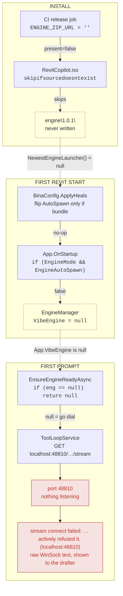
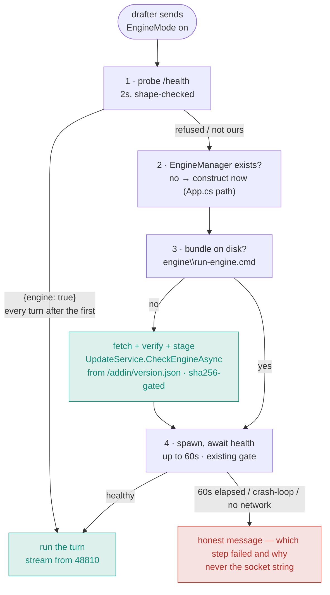

# Engine self-heal — the add-in owns the engine's lifecycle

**Date:** 2026-08-27
**Status:** design approved, PR 1 in progress on `fix/engine-self-heal-in-session`
**Symptom this kills:** `stream connect failed: No connection could be made because the target machine actively refused it. (localhost:48810)`

## Goal

A drafter never sees a dead-socket error, never opens a terminal, never restarts Revit to get the engine. `EngineMode = true` means the add-in gets the engine, starts it, waits for it, and restarts it. No cloud fallback — the engine is the product.

## Today: four polite fallthroughs, one dead socket

Nothing in this chain is a bug on its own. Each stage has a sensible "nothing to do, step aside" branch. They all step aside in the same direction, and the last thing standing is a raw WinSock string.



Dashed edges are the state each stage leaves for the next to read. Every one traces back to the bundle that never got written at install time.

**The honest message already exists.** `ToolLoopService.cs:93` — *"BINA Engine is not installed on this machine…"*. It never fires here because it lives **behind** the `eng == null` early return. The one case the message was written for is the one case it never reaches.

### Evidence

| Claim | Where |
|---|---|
| Every staging release is addin-only | CI run 33050652969: `$url = ''` → `ENGINE_ZIP_URL not set — addin-only release` → `present=false`. Same for 0.0.57, 0.0.56, 0.0.51 |
| Installer skips silently | `installer/RevitCopilot.iss:100` — `skipifsourcedoesntexist` |
| Heal is gated on a bundle | `BinaConfig.cs:528` — `EngineMode && !EngineAutoSpawn && !string.IsNullOrEmpty(NewestEngineLauncher())` |
| Spawn is gated on the flag the heal never set | `App.cs:500` — `if (cfg.EngineMode && cfg.EngineAutoSpawn)` |
| Preflight leaks the socket | `ToolLoopService.cs:79` — `if (eng == null) return null;` |
| The engine zip on the feed is real | ranged GET on the live `engineUrl` → `206`, 1 byte. `CheckEngineAsync` has no "engine must already exist" gate — `NewestInstalledEngineVersion()` returns `0.0.0.0` on a missing dir, so 1.0.1 stages on a bare box |

**Not a bug:** `publish-unsigned-staging.ps1:178` carrying engine fields forward across addin pointer flips. The engine has its own release cadence; dropping them would de-colocate the staging fleet. Leave it.

## After: the preflight makes it healthy instead of asking if it is



Green is the every-turn path on a healthy box: one 2s probe, then straight to the stream. Everything below runs only when that probe fails — and it runs **inside the turn**. The drafter waits once, on first use, the way they'd wait for a cold model load.

While it runs, the pane shows a status line:

```
Setting up BINA Engine…
Downloading engine 1.0.1…
Starting BINA Engine…
```

Step 3's fetch loops back into step 4: the bundle lands and the spawn happens in the **same turn**. That is what heals a box already out there without a reinstall.

## Who owns what after the change

| Seam | Today | After | PR |
|---|---|---|---|
| `ToolLoopService.cs:79` | `if (eng == null) return null` — dial blind | Construct the manager, fetch the bundle if missing, spawn, await health. Return a reason only when all of that fails | 1 |
| `BinaConfig.cs:528` | Flip `EngineAutoSpawn` only if a bundle exists | Flip whenever `EngineMode` is on. "Bundle exists?" moves to the preflight, which can answer it by fetching one. Update the comment at `:524` — it documents the exact behaviour being deleted | 1 |
| `UpdateService.cs:339` | `private static CheckEngineAsync(UpdateFeed)` | `internal` + a no-arg entry that re-reads `/addin/version.json`, so the preflight can call it mid-session. `UpdateService.Pending` is the **addin** update, not the engine — don't reuse it | 1 |
| `release.yml:174` | `ENGINE_ZIP_URL` unset → addin-only build, silently | Pull `engine_key` from the TM One pointer with the creds CI already has (`publish-staging-unsigned` uses them), sha-verify against `engine_sha256`, seed via `/DEngineDir`. Build **fails** if the pointer names an engine it can't fetch. Keep `ENGINE_ZIP_URL` as an explicit override for cutting a new engine | 2 |
| `installer/engine-boot.ps1` | Merged in #100, dormant — no bundle to boot | Unchanged. PR 2 gives it a bundle, so the logon task registers and the engine is up before Revit opens. Re-read on a Windows box first — it has never been parsed by PowerShell | 2 activates |
| `EngineManager` watchdog | Crash → respawn ×3, backed off | Unchanged | — |

## Progress plumbing — scoped honestly

`ToolTurn.status` is one-shot (`ToolLoopDtos.cs:15`) and the reasoning trail is fed from the SSE stream, which opens **after** the preflight. Progressive "downloading → starting" lines therefore need an `Action<string>` progress callback appended as synthetic reasoning steps.

- **v1 (PR 1):** block with the pane's generic busy indicator during the preflight; land the honest message on failure. Never the socket string.
- **v1.1:** the progress callback, once the pane's busy state is confirmed to accept synthetic steps before the stream opens.

Don't claim "same UX as a cold model load" until v1.1 lands.

## What the drafter sees, worst case

Fresh install, no engine on disk, opens Revit, types a prompt. One busy indicator for roughly 60–90 seconds while the bundle downloads and boots. Then the answer. Every turn after that is instant. No terminal, no restart, no cloud.

**The one case that stays:** a bare box with **no network** at first use — nothing can fetch a bundle. After PR 2 the installer always carries the engine, so that box still has the local half; only gateway inference needs the wire.

## Order and why

1. **PR 1** — preflight + heal + `CheckEngineAsync` exposure. One behaviour change. Heals every box already out there on its next OTA, without reinstalling.
2. **PR 2** — installer seeds the engine. Fresh installs never take the download path. Wakes the logon task from #100.

Separate PRs so a bad one reverts alone.

### Tests

The test project cherry-picks source files (`Tests/Tests.csproj`) precisely so pure logic is testable without `HttpClient` or Revit:

- **heal decision** — `EngineMode` on ⇒ `EngineAutoSpawn` on, regardless of bundle; cloud-mode configs untouched
- **message selection** — every non-healthy `Status` maps to a human sentence; `null` is returned only for `healthy`
- **CI sha gate** — scripted dry-run: pointer names an engine, fetched bytes don't match ⇒ build fails

### Dev-rig note

A developer running `start-engine.ps1` by hand with auto-spawn off currently relies on the `eng == null` → dial path. After PR 1 that box gets a manager constructed and `EnsureRunningAsync` called — which is idempotent: health-first (`EngineManager.cs:124`), so it attaches to the hand-started engine rather than fighting it.
